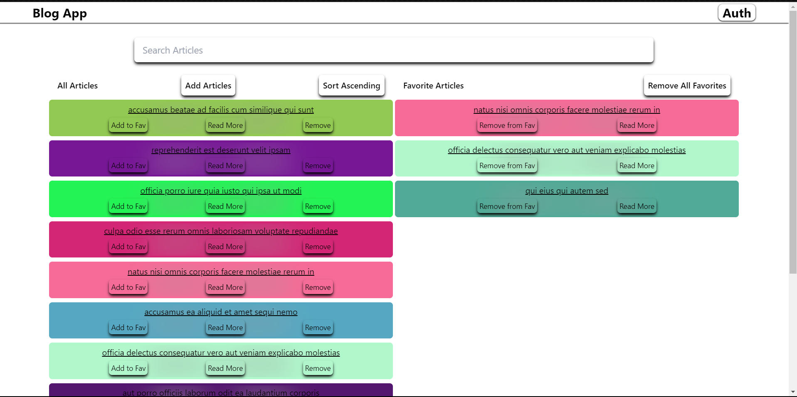
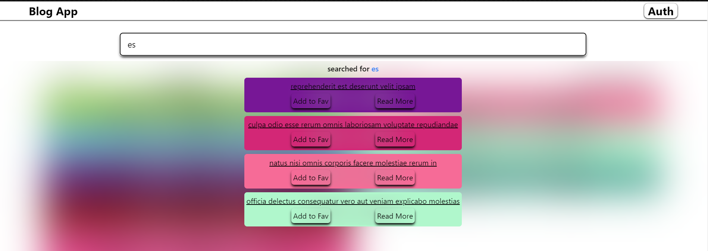
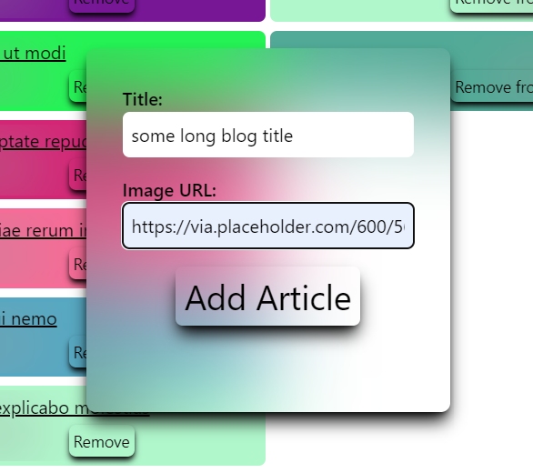
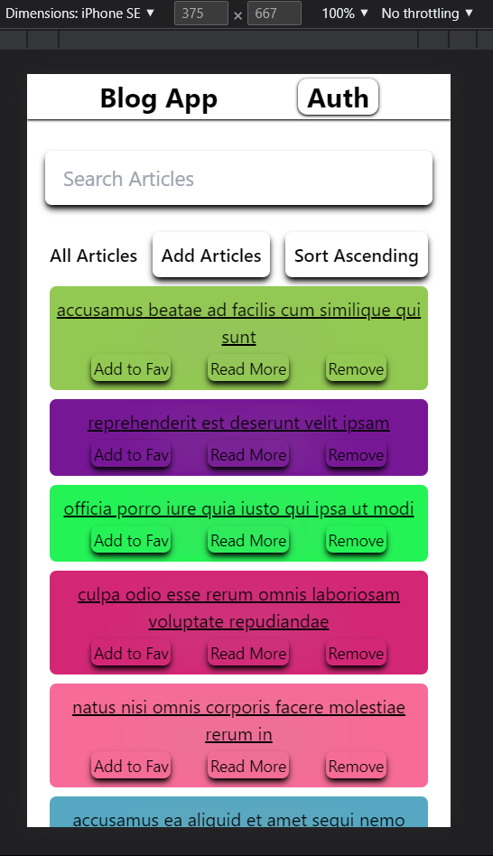
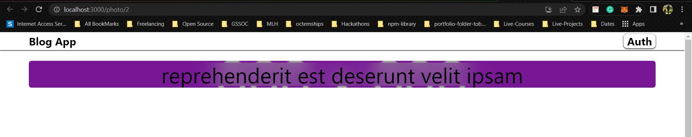

# Auctopus Blog App

- This is simple blog-app built on CRA along with tailwind CSS for styling and placeholder for API calls.
- We are using [jsonplaceholder](https://jsonplaceholder.typicode.com/) for API calls.
- We are also using redux, redux-thunk for state management.
- We are using react-router-dom for routing.

## How to run the app

```bash
# Clone the repo
git clone https://github.com/mstomar698/auctopus-blog-app.git

# Install dependencies
npm install

# Run the app
npm start
```

> ### Demo Link: [Video](https://drive.google.com/file/d/1sWBtBGEkQ_BOz23TMARRhALFADZPraAo/view?usp=sharing) || [Link](https://auctopus-blog-app.netlify.app/)

## Tech Stack

- React
- Redux
- Redux-thunk
- Tailwind CSS
- React-router-dom

## Testing

- Jest
- React Testing Library

### How to run tests

```bash
# Run tests
npm test
```

## Features

- Home page with list of blogs.
- Blog details page with comments.
- Add new blog page.
- Delete blog.
- Add Blogs to Favorites.
- Remove Blogs from Favorites.
- Search Blogs by title.
- Search Blogs by body.
- Sort Blogs by title.
- Sort Blogs by body.

### Screenshots






